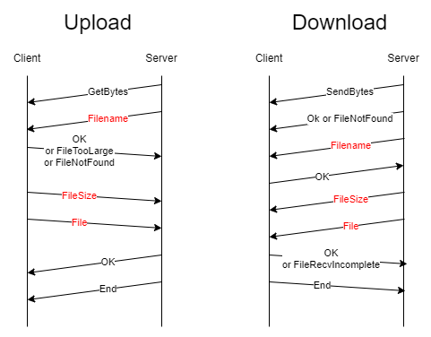

# Python asyncio file-transporter

Python实现的自定义协议，用于在网络上发送和接收文件(二进制数据)。

有关协议规范，请参阅[代码](/server.py)。

这是一个应用层协议，由TCP连接承载，旨在通过发送开始、结束和控制字节，以及定义和处理不同类型的错误，将简单的套接字流转换为传输长文件的可靠方式。

这个异步服务器能够管理多个连接。

## 目录

* [使用](#usage)
* [协议图](#protocol)

## usage

服务端：
- `python server.py` 
- `python server.py -S /tmp/存储地址 -H 127.0.0.1 -P 8888`

客户端：
- 上传：`python client.py -H 127.0.0.1 -P 8888 -U 上传文件目录`
- 下载：`python client.py -H 127.0.0.1 -P 8888 -D 下载的文件`

## 协议图

